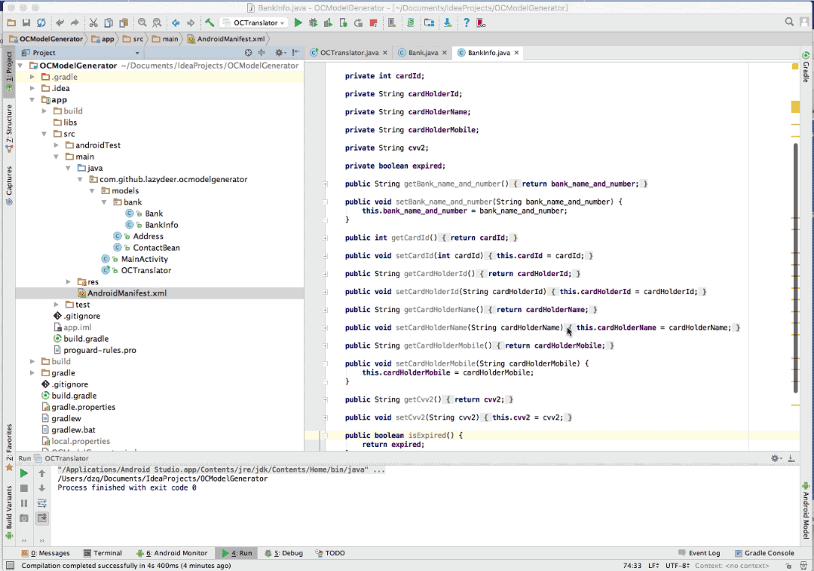

### 使用方法

下载项目中的OCTranslator类，放到自己java或者Android项目中的任意位置，修改类中modelDirectories为自己模型的路径。

```java
 //model文件夹的路径  路径从项目根目录开始到 模型包的位置，可以有多个路径
    static String[] modelDirectories = new String[]{
            "app/src/main/java/com/github/lazydeer/ocmodelgenerator/models"
    };
```

运行文件，后会在根目录中生成OCModelOutput文件夹。里面就oc的模型了。

更大信息参考这里(http://www.jianshu.com/p/dae29ee7e177)

